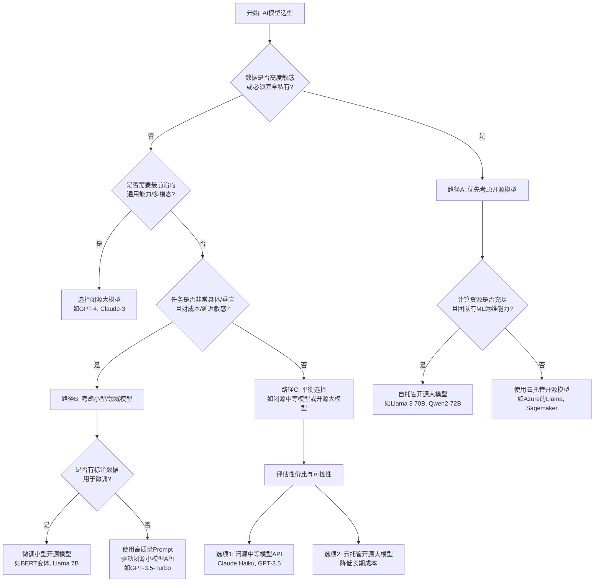

<div style="background: linear-gradient(135deg, #e8f4f8 0%, #f0e6ff 100%); border-left: 4px solid #7c3aed; border-radius: 8px; padding: 20px 24px; margin: 20px 0;">
<div style="display: flex; align-items: center; margin-bottom: 12px;">
<span style="background: #7c3aed; color: white; font-size: 12px; font-weight: bold; padding: 2px 8px; border-radius: 4px; margin-right: 8px;">AI Summary</span>
<span style="font-size: 18px; font-weight: bold;">核心观点总结</span>
</div>

<p style="margin: 8px 0;"><strong>结论先行：</strong>后端工程师进行AI技术选型，应构建一个以业务需求为北极星、以成本与团队能力为约束、以可演进性为目标的系统性决策框架，而非孤立地评估单个技术。</p>

<p style="margin: 8px 0;"><strong>关键要点1：</strong>模型选型是核心，需通过决策树在“开源/闭源”与“大/小模型”间权衡，关键考量是数据隐私、微调需求、推理成本与延迟。</p>

<p style="margin: 8px 0;"><strong>关键要点2：</strong>框架选型（LangChain/LlamaIndex/自研）本质是“开发效率”与“架构控制力”的取舍，中大型复杂应用建议以LangChain为起点，逐步内化核心模式。</p>

<p style="margin: 8px 0;"><strong>关键要点3：</strong>团队转型需设立“AI赋能层”，让Java后端核心与AI服务解耦，通过渐进式项目（如RAG系统）驱动技能提升，并建立模型性能与成本监控体系。</p>

<p style="margin: 8px 0; color: #666; font-size: 13px;">本摘要由 AI 自动生成，基于文章核心内容提炼</p>
</div>

## AI 技术选型决策框架：后端工程师视角

各位Java/后端工程师同仁，大家好。当“为业务接入AI能力”从可选项变为必答题时，我们面临的往往不是单一的技术选择，而是一连串相互关联的决策：是用ChatGPT API快速验证，还是部署一个开源的Llama 3？是用LangChain快速搭建原型，还是自己编写Prompt管理逻辑？是采购云上GPU实例，还是尝试Serverless端点？这些决策环环相扣，一个随意的选择可能在后期带来巨大的技术债或成本失控。

本文旨在为拥有5-7年后端经验的你，提供一个系统性的AI技术选型决策框架。我们将从后端架构师的视角出发，超越工具对比，深入决策背后的核心逻辑、长期成本与架构影响，并规划一条平稳的团队转型路径。

### 核心概念：AI 技术栈的“三层架构”

在深入细节前，我们先建立一个心智模型。一个完整的AI应用技术栈，可以类比为我们熟悉的后端三层架构，但其内涵截然不同：

1.  **模型层 (Model Layer)**：相当于“数据与逻辑层”，但这里的“逻辑”是预训练或微调好的AI模型（如GPT-4、Llama 3、ResNet）。选型核心是模型能力、成本与可控性。
2.  **编排与框架层 (Orchestration & Framework Layer)**：相当于“业务逻辑层”，负责组合模型、工具、外部数据，处理Prompt工程、工作流等。LangChain、LlamaIndex或自研代码作用于此。
3.  **基础设施层 (Infrastructure Layer)**：相当于“持久化与资源层”，为模型运行和推理提供算力（GPU/CPU）、部署环境和监控。包括云GPU、Serverless、私有化集群等。

你的技术选型，本质上是在这三层中做出协同的决策。下图描绘了这一框架及关键决策点：

```
                    +---------------------------------------------------+
                    |                业务需求与约束                     |
                    |    (场景、精度、延迟、成本、数据安全、合规)       |
                    +----------------------+----------------------------+
                                           |
           +-------------------------------+-------------------------------+
           |                               |                               |
           v                               v                               v
+----------------------+     +----------------------+     +----------------------+
|      **模型层**      |     | **编排与框架层**     |     | **基础设施层**       |
|                      |     |                      |     |                      |
| • 闭源 vs 开源       |<--->| • LangChain/LlamaIndex| <->| • 云GPU (A100/H100)  |
| • 大模型 vs 小模型   |     | • 自研Agent框架      |     | • Serverless端点     |
| • 通用 vs 领域       |     | • 简易SDK封装        |     | • 本地部署 (K8s)     |
| • 零样本 vs 微调     |     +----------------------+     | • 混合部署策略       |
+----------------------+                                   +----------------------+
           |                                                         |
           +--------------------------+------------------------------+
                                      |
                                      v
                    +-----------------------------------+
                    |      生产级考量与监控             |
                    |  • 成本监控与优化 (Token/GPU小时) |
                    |  • 性能SLA (延迟、吞吐、可用性)   |
                    |  • 可观测性 (Trace、日志、指标)   |
                    |  • 安全与合规 (数据脱敏、审计)    |
                    +-----------------------------------+
```

接下来，我们逐层拆解决策逻辑。

### 一、模型选型决策树：从“闭源大模型”到“开源小模型”

模型是AI应用的核心引擎。选择不当，要么能力不足，要么成本高昂。决策应从业务场景的清晰定义开始。

**第一步：明确场景与约束**
*   **场景**：是简单的文本分类、内容生成，还是复杂的逻辑推理、多模态理解？
*   **精度要求**：需要“大致不错”还是“高度精确”？能否接受一定的“幻觉”？
*   **延迟与吞吐**：是用户实时交互（<3秒），还是离线批量处理？
*   **数据敏感性**：处理的数据是否涉及用户隐私、公司核心机密？是否需要完全不出域？
*   **预算**：每月推理成本预算是百元、万元还是无明确上限？

**第二步：应用决策树**
基于以上约束，我们可以使用以下决策树进行初步筛选：



**第三步：生产级考量**
*   **成本模型**：闭源模型按Token计费，需精确估算交互模式下的月度费用。开源模型主要成本是GPU实例，需计算峰值并发所需的实例数与运行时间。
*   **备用与降级**：重要业务线应对闭源API依赖有降级方案（如切换到备用API或简化版开源模型）。
*   **版本管理**：模型版本升级可能改变输出行为，需有严格的测试和灰度发布流程。

### 二、框架选型矩阵：LangChain vs LlamaIndex vs 自研

选定模型后，你需要工具来“驱动”它。这个层面，后端工程师最易陷入“过度设计”或“重复造轮子”的陷阱。

| 特性维度 | LangChain | LlamaIndex | 自研框架/SDK封装 |
| :--- | :--- | :--- | :--- |
| **核心定位** | **AI应用编排框架**，构建复杂Agent和工作流的瑞士军刀 | **数据索引与检索框架**，专精于RAG数据连接与查询 | **定制化集成层**，完全控制流程与逻辑 |
| **优势** | 组件丰富（Tools, Agents, Chains），社区活跃，快速原型，覆盖场景广 | 对RAG场景深度优化，数据连接器多，索引策略专业，与向量数据库集成好 | 无额外依赖，轻量级，性能开销最小，与现有Java技术栈集成最紧密，无“黑盒” |
| **劣势** | 抽象较重，学习曲线陡，调试复杂，性能有时非最优，版本迭代快 | 场景相对聚焦（虽在扩展），在非RAG的Agent逻辑上不如LangChain | 开发成本高，需要自行实现模式（如Retry, Fallback），易产生技术债 |
| **适用场景** | 复杂多步Agent应用，需组合多种工具和模型；快速探索和验证阶段 | **以RAG为核心**的知识库、文档问答、数据分析应用 | 需求明确且稳定，对延迟/资源极度敏感；或仅需简单API调用封装 |
| **后端团队上手难度** | 中高（需理解其抽象概念） | 中（概念更集中） | 低（纯代码）但实现完整功能成本高 |

**决策建议**：
*   **从“模仿”开始**：对于大多数刚开始的团队，建议使用**LangChain**快速搭建第一个复杂原型。它的模式（LCEL）是行业事实标准，即使未来自研，你也需要理解这些模式。
*   **聚焦场景**：如果你的应用**核心且主要是RAG**，直接从**LlamaIndex**开始可能效率更高，它更“专”且“精”。
*   **渐进式内化**：在原型验证后，针对性能瓶颈或关键业务流，**用自研代码替换LangChain中的特定Chain或Agent**。例如，你可以继续使用LangChain的`RecursiveCharacterTextSplitter`和向量库集成，但用自己编写的、更高效的Prompt模板和调用逻辑替换复杂的`LLMChain`。

### 三、基础设施选型：GPU云 vs Serverless vs 本地部署

这一层决策直接关联CAPEX（资本支出）和OPEX（运营支出）。

**1. 云GPU实例（如AWS p4d/p5， Azure NCv3/NDv3系列， 阿里云GN7/GN8）**
*   **适用场景**：长期运行、高吞吐、需微调或托管大型开源模型。
*   **架构考量**：需要搭建K8s集群管理GPU节点，实现模型部署、弹性伸缩、版本回滚。考虑使用**KubeFlow Serving**或**Triton Inference Server**进行高效的模型部署和批处理。
*   **成本**：按实例运行时间计费，需精细化的资源调度（如使用Spot实例处理离线任务）。

**2. Serverless AI 端点（如Azure OpenAI, AWS Bedrock, Google Vertex AI）**
*   **适用场景**：使用闭源模型或托管开源模型，希望零运维、按需付费、快速启动。
*   **架构考量**：将AI服务视为一个外部API。重点在于客户端容错（重试、熔断、降级）、API密钥管理和成本监控。**这是从Java后端视角最“友好”的入门方式**。
*   **成本**：按Token或调用次数计费，无闲置成本，但单价可能较高。

**3. 本地/私有化部署**
*   **适用场景**：数据合规强制要求、长期成本优化（规模极大）、或与现有IDC资源整合。
*   **架构考量**：挑战最大。需组建MLOps团队，负责从GPU驱动、容器化、模型仓库、服务网格到监控的全套流水线。可考虑**vLLM**或**TGI** (Text Generation Inference) 来优化开源大模型的推理性能。

**实战代码：一个融合了选型考量的Python服务示例**
假设我们选型为：使用**Azure OpenAI（闭源模型， Serverless）** + **LangChain（快速原型）** 构建一个简单的文档摘要服务，但已开始有意识地将核心逻辑抽象出来，便于未来替换。

```python
# requirements.txt
# langchain==0.1.0
# langchain-openai==0.0.5
# python-dotenv

import os
from typing import Optional
from dotenv import load_dotenv
from langchain_openai import AzureChatOpenAI
from langchain_core.prompts import ChatPromptTemplate
from langchain_core.output_parsers import StrOutputParser
from langchain.text_splitter import RecursiveCharacterTextSplitter
from langchain_core.documents import Document

# 加载配置（从环境变量或配置中心读取）
load_dotenv()

class Config:
    """配置类，集中管理所有外部依赖参数，便于未来切换"""
    AZURE_OPENAI_ENDPOINT = os.getenv("AZURE_ENDPOINT")
    AZURE_OPENAI_API_KEY = os.getenv("AZURE_API_KEY")
    AZURE_DEPLOYMENT_NAME = os.getenv("AZURE_DEPLOYMENT_GPT35") # 可配置不同模型
    API_VERSION = "2024-02-01"
    MAX_TOKENS = 1000
    # 未来可在此添加开源模型端点、本地模型路径等

class AIServiceClient:
    """AI服务客户端，封装底层框架调用，对外提供稳定接口"""
    def __init__(self, config: Config):
        self.config = config
        # 初始化模型 - 这里是LangChain的Azure封装
        self.llm = AzureChatOpenAI(
            azure_endpoint=config.AZURE_OPENAI_ENDPOINT,
            api_key=config.AZURE_OPENAI_API_KEY,
            api_version=config.API_VERSION,
            azure_deployment=config.AZURE_DEPLOYMENT_NAME,
            max_tokens=config.MAX_TOKENS,
            temperature=0.1, # 控制创造性
        )
        # 定义Prompt模板 - 业务逻辑集中于此
        self.summary_prompt = ChatPromptTemplate.from_messages([
            ("system", "你是一个专业的文档摘要助手。请根据用户提供的文档内容，生成一段简洁、准确的摘要，突出核心观点。"),
            ("user", "文档内容：{document_text}")
        ])
        # 构建Chain - LangChain的核心抽象
        self.summary_chain = self.summary_prompt | self.llm | StrOutputParser()
        
        # 文本分割器（可独立于LangChain替换）
        self.text_splitter = RecursiveCharacterTextSplitter(
            chunk_size=2000,
            chunk_overlap=200,
            length_function=len,
        )
    
    def summarize_document(self, full_text: str) -> str:
        """对外提供的文档摘要接口"""
        # 1. 文本预处理（未来可替换分割逻辑）
        docs = self.text_splitter.create_documents([full_text])
        if len(docs) == 0:
            return ""
        
        # 2. 处理长文档：先分块摘要，再汇总（一个简单的Map-Reduce模式）
        if len(docs) > 1:
            chunk_summaries = []
            for doc in docs:
                chunk_summary = self._summarize_chunk(doc.page_content)
                chunk_summaries.append(chunk_summary)
            # 合并分块摘要，进行最终汇总
            combined_text = "\n\n".join(chunk_summaries)
            final_summary = self._summarize_chunk(combined_text)
            return final_summary
        else:
            # 短文档直接处理
            return self._summarize_chunk(docs[0].page_content)
    
    def _summarize_chunk(self, text: str) -> str:
        """内部方法：调用LangChain Chain执行单次摘要
        注意：此方法封装了框架调用，未来若替换框架，只需修改此处。
        """
        try:
            # 这里是唯一直接依赖LangChain抽象的地方
            result = self.summary_chain.invoke({"document_text": text})
            return result
        except Exception as e:
            # 生产环境需添加重试、熔断、降级逻辑
            print(f"AI调用失败: {e}")
            # 降级策略：返回前N个字符作为简单摘要
            return text[:500] + "... [摘要生成失败]"

# 使用示例
if __name__ == "__main__":
    config = Config()
    ai_client = AIServiceClient(config)
    
    sample_doc = """
    人工智能（AI）是计算机科学的一个分支，旨在创造能够执行通常需要人类智能的任务的机器。
    这些任务包括学习、推理、问题解决、感知和语言理解。近年来，深度学习技术的突破，
    特别是基于Transformer架构的大语言模型（LLM），极大地推动了自然语言处理领域的发展。
    例如，GPT系列模型能够生成连贯、相关的文本，应用于聊天机器人、内容创作和代码生成等场景。
    然而，AI的发展也带来了伦理、就业和社会结构等方面的挑战。
    """
    
    summary = ai_client.summarize_document(sample_doc)
    print("生成的摘要：")
    print(summary)
    # 预期输出：人工智能是计算机科学分支，旨在执行人类智能任务。深度学习与大语言模型（如GPT）推动了自然语言处理发展，应用于聊天、创作等领域，但也带来伦理与社会挑战。
```

这个示例展示了**封装与隔离**的思想：`AIServiceClient` 对外提供稳定的 `summarize_document` 接口，内部虽然使用了LangChain，但关键依赖（模型初始化、Prompt、Chain调用）被集中管理，为未来替换为自研逻辑或LlamaIndex留出了空间。

### 四、从Java技术栈到AI技术栈的团队转型路径

转型不是推翻重来，而是渐进式融合。

1.  **设立“AI赋能层”**：在现有Java后端架构中，引入一个独立的 **AI Service** 模块（可以是Python或Java（通过DJL）实现）。Java核心业务通过内部RPC或HTTP调用此服务，实现技术栈隔离。
2.  **技能提升路径**：
    *   **第一阶段（普及）**：全体后端学习Prompt工程、大模型基本原理、闭源API调用。**项目驱动**：改造一个现有的“通知生成”或“内容审核”模块，用GPT-3.5 API实现。
    *   **第二阶段（深入）**：成立2-3人的AI专项小组，深入LangChain/LlamaIndex、向量数据库（如Milvus）、开源模型微调。**项目驱动**：搭建一个公司内部知识库问答系统（RAG）。
    *   **第三阶段（融合）**：专项小组将沉淀出的模式、工具链（如模型监控、成本分析）反哺给整个后端团队，并开始参与制定AI相关的架构规范。
3.  **建立生产保障体系**：
    *   **监控**：不仅要监控服务可用性，更要监控**AI特有指标**：每次调用的Token消耗、成本折合、输入/输出长度、响应延迟分布。将AI调用成本像数据库查询成本一样可视化。
    *   **测试**：建立AI功能的**非确定性测试**策略：使用评估框架（如RAGAS）对输出进行质量评估，构建包含“标准问题-期望答案”对的测试集，定期回归。
    *   **运维**：制定模型版本升级、回滚流程；对自托管模型，建立GPU资源调度和弹性伸缩策略。

### 总结

对于后端工程师而言，驾驭AI技术栈的关键在于**运用我们已有的架构思维**——关注边界、抽象、成本与演进。技术选型没有银弹，决策框架的价值在于提供系统性的思考路径：

1.  **模型选型**是战略决策，锚定业务需求，在能力、成本与可控性的铁三角中寻找平衡点。
2.  **框架选型**是战术选择，从高效起步（LangChain/LlamaIndex），逐步内化核心模式，向可控、高性能的定制化方向演进。
3.  **基础设施选型**是成本与运维的权衡，Serverless降低启动门槛，云GPU提供规模化能力，本地部署满足极致合规与控制。
4.  **团队转型**是系统工程，通过设立隔离层、项目驱动和建立生产级监控，实现平稳、可持续的能力跨越。

希望这个框架能帮助你在AI浪潮中，不仅成为技术的使用者，更能成为稳健的架构决策者。

### 参考资料
1.  LangChain官方文档: https://python.langchain.com/
2.  LlamaIndex官方文档: https://docs.llamaindex.ai/
3.  Hugging Face Model Hub: https://huggingface.co/models
4.  vLLM: 高性能开源大模型推理框架: https://github.com/vllm-project/vllm
5.  《Building LLM-powered Applications》 by Valentina Alto (O‘Reilly)
6.  AWS Well-Architected Machine Learning Lens: https://docs.aws.amazon.com/wellarchitected/latest/machine-learning-lens/welcome.html
